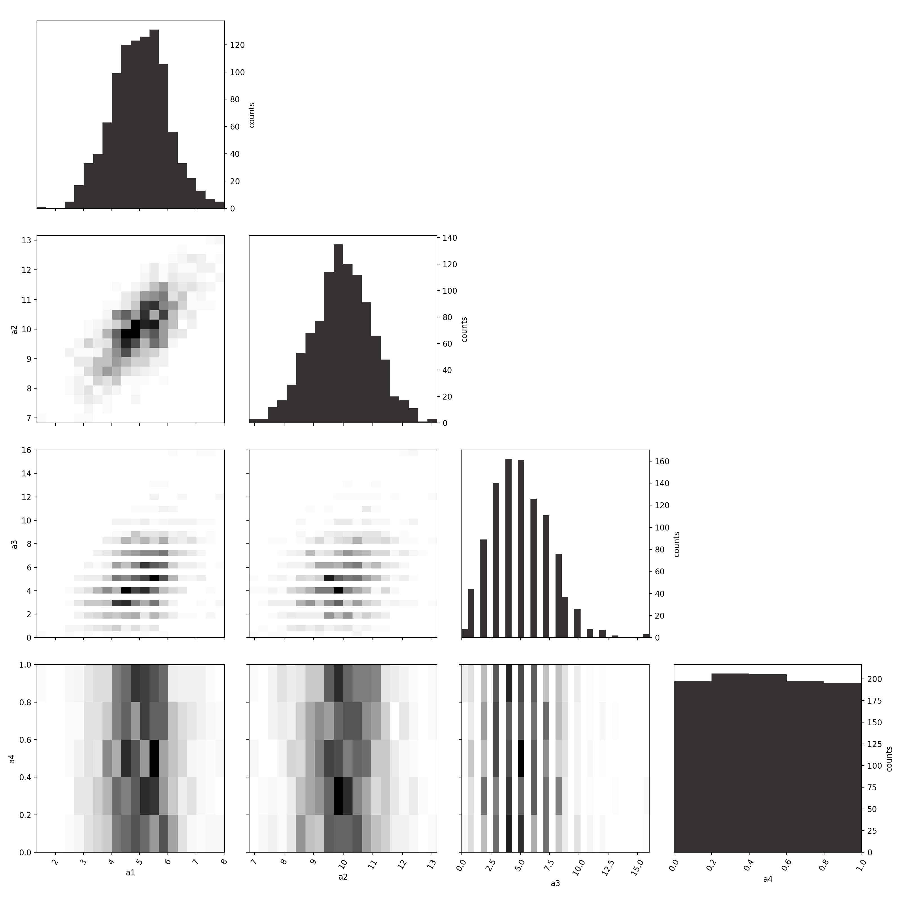

# corner_hist

Creates corner plots similar to [the corner module](https://github.com/dfm/corner.py) which are a great way
to view MCMC chains for example.

Here, instead of giving data points, an already created histogram is put in.
This can be useful when only multidimensional histograms are available and we
quickly need to view all the 1D and 2D marginalizations.

**Attention:** For the marginalization, all other dimensions are simply summed up.
So this is faulty when using normalized histograms as it should sum by weighting with the bin sizes.

